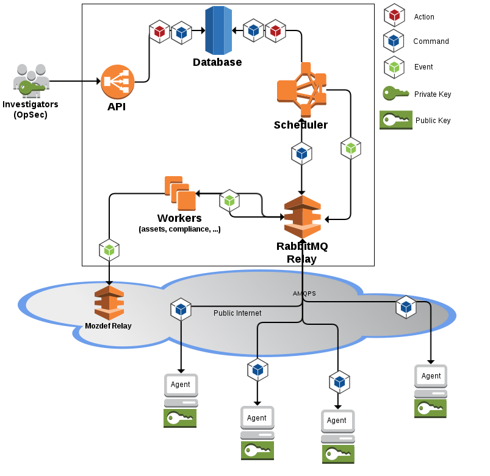
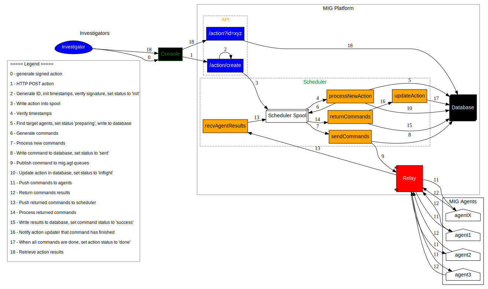

===================================================
Mozilla InvestiGator Concepts & Internal Components
===================================================

.. sectnum::
.. contents:: Table of Contents

MIG is a platform to perform investigative surgery on remote endpoints.
It enables investigators to obtain information from large numbers of systems
in parallel, thus accelerating investigation of incidents.

Besides scalability, MIG is designed to provide strong security primitives:

* **Access control** is ensured by requiring GPG signatures on all actions. Sensitive
  actions can also request signatures from multiple investigators. An attacker
  who takes over the central server will be able to read non-sensitive data,
  but will not be able to send actions to agents. The GPG keys are securely
  kept by their investigators.
* **Privacy** is respected by never retrieving raw data from endpoints. When MIG is
  run on laptops or phones, end-users can request reports on the operations
  performed on their devices. The 2-man-rule for sensitive actions also prevents
  rogue investigators invading privacy.
* **Reliability** is built in. No component is critical. If an agent crashes, it
  will attempt to recover and reconnect to the platform indefinitely. If the
  platform crashes, a new platform can be rebuilt rapidly without backups.

MIG privileges a model where requesting information from endpoints is fast and
simple. It does not attempt to record everything all the time. Instead, it
assumes that when a piece of information is needed, it will be easy to retrieve it.

It's an army of Sherlock Holmes, ready to interrogate your network within
milliseconds.

Terminology:

* **Investigators**: humans who use clients to investigate things on agents
* **Agent**: a small program that runs on a remote endpoint. It receives commands
  from the scheduler through the relays, executes those commands using modules,
  and sends the results back to the relays.
* **Loader**: a small bootstrapping program that can optionally be used to keep
  agents up to date on remote endpoints
* **Module**: single feature Go program that does stuff, like inspecting a file
  system, listing connected IP addresses, creating user accounts or adding
  firewall rules
* **Scheduler**: a messaging daemon that routes actions and commands to and from
  agents.
* **Relay**: a RabbitMQ server that queues messages between schedulers and agents.
* **Database**: a storage backend used by the scheduler and the api
* **API**: a REST api that exposes the MIG platform to clients
* **Client**: a program used by an investigator to interface with MIG (like the
  MIG Console, or the action generator)
* **Worker**: a worker is a small extension to the scheduler and api that
  performs very specific tasks based on events received via the relay.

An investigator uses a client (such as the MIG Console) to communicate with
the API. The API interfaces with the Database and the Scheduler.
When an action is created by an investigator, the API receives it and writes
it into the spool of the scheduler (they share it via NFS). The scheduler picks
it up, creates one command per target agent, and sends those commands to the
relays (running RabbitMQ). Each agent is listening on its own queue on the relay.
The agents execute their commands, and return the results through the same
relays (same exchange, different queues). The scheduler writes the results into
the database, where the investigator can access them through the API.
The agents also use the relays to send heartbeat at regular intervals, such that
the scheduler always knows how many agents are alive at a given time.

The end-to-end workflow is:

 ::

    {investigator} -https-> {API}        {Scheduler} -amqps-> {Relays} -amqps-> {Agents}
                                \           /
                              sql\         /sql
                                 {DATABASE}

Below is a high-level view of the architecture:

Actions
-------

Actions are JSON files created by investigators to perform tasks on agents.

For example, an investigator who wants to verify that root passwords are hashed
and salted on linux systems, would use the following action:

.. code:: json

	{
		"name": "verify root password storage method",
		"target": "agents.queueloc like 'linux.%'",
		"threat": {
			"family": "compliance",
			"level": "low",
			"ref": "syslowauth3",
			"type": "system"
		},
		"description": {
			"author": "Julien Vehent",
			"email": "ulfr@mozilla.com",
			"revision": 201503121200
		},
		"operations": [
			{
				"module": "file",
				"parameters": {
					"searches": {
						"root_passwd_hashed_or_disabled": {
							"paths": [
								"/etc/shadow"
							],
							"contents": [
								"root:(\\*|!|\\$(1|2a|5|6)\\$).+"
							]
						}
					}
				}
			}
		],
		"syntaxversion": 2
	}

The parameters are:

* **name**: a string that represents the action.
* **target**: a search string used by the scheduler to find agents to run the
  action on. The target format uses Postgresql's WHERE condition format against
  the `agents`_ table of the database. This method allows for complex target
  queries, like running an action against a specific operating system, or
  against an endpoint that has a given public IP, etc...

  The most simple query that targets all agents is `name like '%'` (the `%`
  character is a wildcard in SQL pattern matching). Targeting by OS family can
  be done on the `os` parameters such as `os='linux'` or `os='darwin'`.

  Combining conditions is also trivial: `version='201409171023+c4d6f50.prod'
  and heartbeattime > NOW() - interval '1 minute'` will only target agents that
  run a specific version and have sent a heartbeat during the last minute.

  Complex queries are also possible.
  For example: imagine an action with ID 1 launched against 10,000 endpoints,
  which returned 300 endpoints with positive results. We want to launch action
  2 on those 300 endpoints only. It can be accomplished with the following
  `target` condition. (note: you can reuse this condition by simply changing
  the value of `actionid`)

.. code:: sql

	id IN (select agentid from commands, json_array_elements(commands.results) as r where actionid=1 and r#>>'{foundanything}' = 'true')

.. _`agents`: data.rst.html#entity-relationship-diagram

* **description** and **threat**: additional fields to describe the action
* **operations**: an array of operations, each operation calls a module with a set
  of parameters. The parameters syntax are specific to the module.
* **syntaxversion**: indicator of the action format used. Should be set to 2

Upon generation, additional fields are appended to the action:

* **pgpsignatures**: all of the parameters above are concatenated into a string and
  signed with the investigator's private GPG key. The signature is part of the
  action, and used by agents to verify that an action comes from a trusted
  investigator. `PGPSignatures` is an array that contains one or more signatures
  from authorized investigators.
* **validfrom** and **expireafter**: two dates that constrain the validity of the
  action to a UTC time window.

Investigation workflow
-----------------------
The diagram below represents the full workflow from the launch of an action by
an investigation, to the retrieval of results from the database. The steps are
explained in the legend of the diagram, and map to various components of MIG.

Actions are submitted to the API by trusted investigators. PGPSignatures are
verified by the API and each agent prior to running any command.

View `full size diagram`_.

.. _`full size diagram`: .files/action_command_flow.svg

Access Control Lists
--------------------

Not all keys can perform all actions. The scheduler, for example, sometimes needs
to issue specific actions to agents but
shouldn't be able to perform more dangerous actions. This is enforced by
an Access Control List, or ACL, stored on the agents. An ACL describes who can
access what function of which module. It can be used to require multiple
signatures on specific actions, and limit the list of investigators allowed to
perform an action.

An ACL is composed of permissions, which are JSON documents hardwired into
the agent configuration. In the future, MIG will dynamically ship permissions
to agents.

Below is an example of a permission for the `filechecker` module:

.. code:: json

    {
        "filechecker": {
            "minimumweight": 2,
            "investigators": {
                "Bob Kelso": {
                    "fingerprint": "E60892BB9BD...",
                    "weight": 2
                },
                "John Smith": {
                    "fingerprint": "9F759A1A0A3...",
                    "weight": 1
                }
            }
        }
    }

`investigators` contains a list of users with their PGP fingerprints, and their
weight, an integer that represents their access level.
When an agent receives an action that calls the filechecker module, it will
first verify the signatures of the action, and then validates that the signers
are authorized to perform the action. This is done by summing up the weights of
the signatures, and verifying that they equal or exceed the minimum required
weight.

Thus, in the example above, investigator John Smith cannot issue a filechecker
action alone. His weight of 1 doesn't satisfy the minimum weight of 2 required
by the filechecker permission. Therefore, John will need to ask investigator Bob
Kelso to sign his action as well. The weight of both investigators are then
added, giving a total of 3, which satisfies the minimum weight of 2.

This method gives ample flexibility to require multiple signatures on modules,
and ensures that one investigator cannot perform sensitive actions on remote
endpoints without the permissions of others.

The default permission `default` can be used as a default for all modules. It
has the following syntax:

.. code:: json

	{
		"default": {
			"minimumweight": 2,
			"investigators": { ... }
			]
		}
	}

The `default` permission is overridden by module specific permissions.

The ACL is currently applied to modules. In the future, ACL will have finer
control to authorize access to specific functions of modules. For example, an
investigator could be authorized to call the `regex` function of filechecker
module, but only in `/etc`. This functionality is not implemented yet.

Threat Model
------------

Running an agent as root on a large number of endpoints means that Mozilla
InvestiGator is a target of choice to compromise an infrastructure.
Without proper protections, a vulnerability in the agent or in the platform
could lead to a compromission of the endpoints.

The architectural choices made in MIG diminish the exposure of the endpoints to
a compromise. And while the risk cannot be reduced to zero entirely, it would
take an attacker direct control on the investigator's key material, or be root
on the infrastructure in order to take control of MIG.

MIG's security controls include:

* Strong GPG security model
* Infrastructure resiliency
* No port listening
* Protection of connections to the relays
* Randomization of the queue names
* Whitelisting of agents
* Limit data extraction to a minimum

Strong GPG security model
~~~~~~~~~~~~~~~~~~~~~~~~~

All actions that are passed to the MIG platform and to the agents require
valid GPG signatures from one or more trusted investigators. The public keys of
trusted investigators are hardcoded in the agents, making it almost impossible
to override without root access to the endpoints, or access to an investigator's
private key. The GPG private keys are never seen by the MIG platform (API,
Scheduler, Database or Relays). A compromise of the platform would not lead to
an attacker taking control of the agents and compromising the endpoints.

Infrastructure resiliency
~~~~~~~~~~~~~~~~~~~~~~~~~

One of the design goals of MIG is to make each components as stateless as
possible. The database is used as a primary data store, and the schedulers and
relays keep data in transit in their respective cache. But any of these
components can go down and be rebuilt without compromising the resiliency of
the platform. As a matter of fact, it is strongly recommended to rebuild each
of the platform components from scratch on a regular basis, and only keep the
database as a persistent storage.

Unlike other systems that require constant network connectivity between the
agents and the platform, MIG is designed to work with intermittent or unreliable
connectivity with the agents. The rabbitmq relays will cache commands that are
not consumed immediately by offline agents. These agents can connect to the
relay whenever they choose to, and pick up outstanding tasks.

If the relays go down for any period of time, the agents will attempt to
reconnect at regular intervals continuously. It is trivial to rebuild
a fresh rabbitmq cluster, even on a new IP space, as long as the FQDN of the
cluster, and the TLS cert/key and credentials of the AMQPS access point
remain the same.

No port listening
~~~~~~~~~~~~~~~~~

The agents do not accept incoming connections. There is no listening port that
an attacker could use to exploit a vulnerability in the agent. Instead, the
agent connects to the platform by establishing an outbound connection to the
relays. The connection uses TLS, making it theorically impossible for an
attacker to MITM without access to the PKI and DNS, both of which are not
part of the MIG platform.

Protection of connections to the relays
~~~~~~~~~~~~~~~~~~~~~~~~~~~~~~~~~~~~~~~

The rabbitmq relay of a MIG infrastructure may very well be listening on the
public internet. This is used when MIG agents are distributed into various
environments, as opposed to concentrated on a single network location. RabbitMQ
and Erlang provide a stable network stack, but are not shielded from a network
attack that would take down the cluster. To reduce the exposure of the AMQP
endpoints, the relays use AMQP over TLS and require the agents to present a
client certificate before accepting the connection.

The client certificate is shared across all the agents. **It is not used as an
authentication mechanism.** Its sole purpose is to limit the exposure of a public
AMQP endpoint. Consider it a network filter.

Once the TLS connection between the agent and the relay is established, the
agent will present a username and password to open the AMQP connection. Again,
these credentials are shared across all agents, and are not used to authenticate
individual agents. Their role is to assign an ACL to the agent.
The ACL limits the AMQP action an agent can perform on the cluster.
See `rabbitmq configuration`_ for more information.

.. _`rabbitmq configuration`: configuration.rst

Randomization of the queue names
~~~~~~~~~~~~~~~~~~~~~~~~~~~~~~~~

The protections above limit the exposure of the AMQP endpoint, but since the
secrets are shared across all agents, the possibility still exists that an
attacker gains access to the secrets, and establishes a connection to the relays.

Such access would have very limited capabilities. It cannot be used to publish
commands to the agents, because publication is ACL-limited to the scheduler.
It can be used to publish fake results to the scheduler, or listen on the
agent queue for incoming commands.

Both are made difficult by prepending a random number to the name of an agent
queue. An agent queue is named using the following scheme:

	`mig.agt.<OS family>.<Hostname>.<uid>`

The OS and hostname of a given agent are easy to guess, but the uid isn't.
The UID is a 64 bits integer composed of nanosecond timestamps and a random 32
bits integer, chosen by the agent on first start. It is specific to an endpoint.

Whitelisting of agents
~~~~~~~~~~~~~~~~~~~~~~

At the moment, MIG does not provide a strong mechanism to authenticate agents.
It is a work in progress, but for now agents are whitelisted in the scheduler
using the queuelocs that are advertised in the heartbeat messages. Spoofing the
queueloc string is difficult, because it contains a random value that is
specific to an endpoint. An attacker would need access to the random value in
order to spoof an agent's identity. This method provides a basic access control
mechanism. The long term goal is to allow the scheduler to call an external database
to authorize agents. In AWS, the scheduler could call the AWS API to verify that
a given agent does indeed exist in the infrastructure. In a traditional datacenter,
this could be an inventory database.

Limit data extraction to a minimum
~~~~~~~~~~~~~~~~~~~~~~~~~~~~~~~~~~

Agents are not `meant` to retrieve raw data from their endpoints. This is more
of a good practice rather than a technical limitation. The modules shipped with
the agent are meant to return boolean answers of the type "match" or "no match".

It could be argued that answering "match" on sensitive requests is similar to
extracting data from the agents. MIG does not solve this issue.. It is the
responsibility of the investigators to limit the scope of their queries (ie, do
not search for a root password by sending an action with the password in the
regex).

The goal here is to prevent a rogue investigator from dumping a large amount of
data from an endpoint. MIG could trigger a memory dump of a process, but
retrieving that data will require direct access to the endpoint.

Note that MIG's database keeps records of all actions, commands and results. If
sensitive data were to be collected by MIG, that data would be available in the
database.
