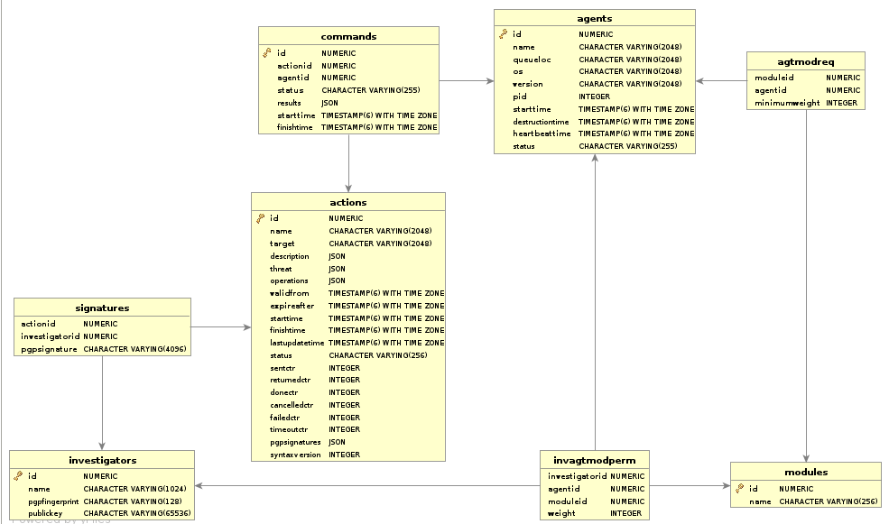

========
MIG Data
========
:Author: Julien Vehent <jvehent@mozilla.com>

.. sectnum::
.. contents:: Table of Contents

Scheduler Spool
---------------

MIG data is stored both on the file system of the scheduler, and in mongodb. On
the scheduler, each action and command are stored individually in a text file in
/var/cache/mig (by default).

.. code:: bash

	$ tree -d /var/cache/mig/
	/var/cache/mig/
	├── action
	│   ├── done
	│   ├── inflight
	│   ├── invalid
	│   └── new
	└── command
		├── done
		├── inflight
		├── ready
		└── returned

	10 directories

Postgresql Schema
-----------------

Entity-Relationship Diagram
~~~~~~~~~~~~~~~~~~~~~~~~~~~

Structure & Tables
~~~~~~~~~~~~~~~~~~

The `actions` table contains the detail of each action ran by the MIG platform.
Its structure contains the base action fields found in the json format of an
action, plus a number of additional fields such as timestamps and counters.

.. code:: sql

	CREATE TABLE IF NOT EXISTS actions (
		id numeric PRIMARY KEY,
		name varchar(2048) NOT NULL,
		target varchar(2048) NOT NULL,
		description json,
		threat json,
		operations json,
		validfrom timestamp with time zone NOT NULL,
		expireafter timestamp with time zone NOT NULL,
		starttime timestamp with time zone,
		finishtime timestamp with time zone,
		lastupdatetime timestamp with time zone,
		status varchar(256),
		sentctr integer,
		returnedctr integer,
		donectr integer,
		cancelledctr integer,
		failedctr integer,
		timeoutctr integer,
		pgpsignatures json,
		syntaxversion integer
	);

The `agents` table contains the registrations of each agents known of the MIG
platform.

.. code:: sql

	CREATE TABLE IF NOT EXISTS agents (
		id numeric PRIMARY KEY,
		name varchar(2048) NOT NULL,
		queueloc varchar(2048) NOT NULL,
		os varchar(2048) NOT NULL,
		version varchar(2048) NOT NULL,
		pid integer NOT NULL,
		starttime timestamp with time zone NOT NULL,
		destructiontime timestamp with time zone,
		heartbeattime timestamp with time zone NOT NULL,
		status varchar(256),
		environment json
	);

The `commands` table contains each action sent to each agent.

.. code:: sql

	CREATE TABLE IF NOT EXISTS commands (
		id numeric PRIMARY KEY NOT NULL,
		actionid numeric references actions(id) NOT NULL,
		agentid numeric references agents(id) NOT NULL,
		status varchar(256) NOT NULL,
		results json,
		starttime timestamp with time zone NOT NULL,
		finishtime timestamp with time zone
	);

`investigators` have a table that contains their public PGP key, and can be
used when verifying signatures and generating ACLs.

.. code:: sql

	CREATE TABLE IF NOT EXISTS investigators (
		id numeric PRIMARY KEY NOT NULL,
		name varchar(1024) NOT NULL,
		pgpfingerprint varchar(128) NOT NULL,
		publickey varchar(65536)
	);
	CREATE UNIQUE INDEX ON investigators (pgpfingerprint);

The `signatures` table is a junction between an action and the investigators
that signed the action.

.. code:: sql

	CREATE TABLE IF NOT EXISTS signatures (
		actionid numeric references actions(id) NOT NULL,
		investigatorid numeric references investigators(id) NOT NULL,
		pgpsignature varchar(4096) NOT NULL
	);
	CREATE UNIQUE INDEX ON signatures (actionid, investigatorid);
	CREATE INDEX ON signatures (actionid);
	CREATE INDEX ON signatures (investigatorid);

Agents modules are registered in the `modules` table.

.. code:: sql

	CREATE TABLE IF NOT EXISTS modules (
		id numeric PRIMARY KEY NOT NULL,
		name varchar(256) NOT NULL
	);

ACLs are managed in two junction tables. First, the `agtmodreq` table contains
the minimum weight an action must have to run a particular module on a given
agent.

.. code:: sql

	CREATE TABLE IF NOT EXISTS agtmodreq (
		moduleid numeric references modules(id) NOT NULL,
		agentid numeric references agents(id) NOT NULL,
		minimumweight integer NOT NULL
	);
	CREATE UNIQUE INDEX ON agtmodreq (moduleid, agentid);
	CREATE INDEX ON agtmodreq (moduleid);
	CREATE INDEX ON agtmodreq (agentid);

Second, the `invagtmodperm` table give a weight to an investigator for a module
on an agent. This model allows for very fine grained permissions management.

.. code:: sql

	CREATE TABLE IF NOT EXISTS invagtmodperm (
		investigatorid numeric references investigators(id) NOT NULL,
		agentid numeric references agents(id) NOT NULL,
		moduleid numeric references modules(id) NOT NULL,
		weight integer NOT NULL
	);
	CREATE UNIQUE INDEX ON invagtmodperm (investigatorid, agentid, moduleid);
	CREATE INDEX ON invagtmodperm (investigatorid);
	CREATE INDEX ON invagtmodperm (agentid);
	CREATE INDEX ON invagtmodperm (moduleid);

Database creation script
~~~~~~~~~~~~~~~~~~~~~~~~

.. include:: .files/createdb.sh
	:code: bash

Queries
-------

Adding Investigators
~~~~~~~~~~~~~~~~~~~~

In the future, this will probably be automated via the API. But for now, and
until we have a strong authentication mechanism for API calls, it must be done
manually in the database.

Adapt the query below to add a new investigator.

.. code:: sql

	INSERT INTO investigators (name, pgpfingerprint)
	VALUES ('Bob Kelso', 'E608......');

Finding offline agents
~~~~~~~~~~~~~~~~~~~~~~

The following query retrieves a list of agents that have been online over the
last 30 days, but have not sent a heartbeat in the last 5 minutes.

.. code:: sql

	SELECT DISTINCT(name) FROM agents
	WHERE name IN (
		SELECT DISTINCT(name) FROM agents
		WHERE heartbeattime >= NOW() - interval '30 days'
	) AND name NOT IN (
		SELECT DISTINCT(name) FROM agents
		WHERE heartbeattime >= NOW() - interval '5 minutes'
	) ORDER BY name;

Finding double agents
~~~~~~~~~~~~~~~~~~~~~

Sometimes during upgrades the older agent isn't shut down. You can find these
endpoints with double agents in the database because each agent sends separate
heartbeats for the same endpoint:

.. code:: sql

	SELECT COUNT(name), name FROM agents
	WHERE heartbeattime >= NOW() - INTERVAL '10 minutes'
	GROUP BY name ORDER BY count(name) DESC;

This query will list all the agents sorted by the count of agents heartbeatting
on each endpoint::

    | count  |             name
    |--------+--------------------------------------
    | 3      | puppet3.private.dc1.example.net
    | 2      | mv1.mv.example.net
    | 2      | memcache1.webapp.dc1.example.net
    | 2      | ip2.dc.example.net
    | 2      | command.private.corp.dc1.example.net
    | 1      | backup1.private.dc1.example.net
    | 1      | backup2.db.dc1.example.net
    | 1      | intranet4.db.dc3.example.net
